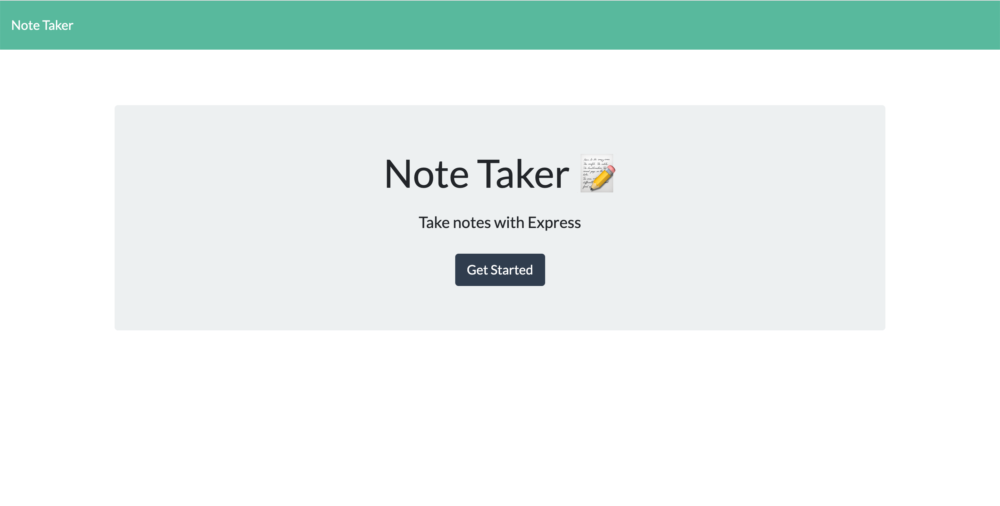
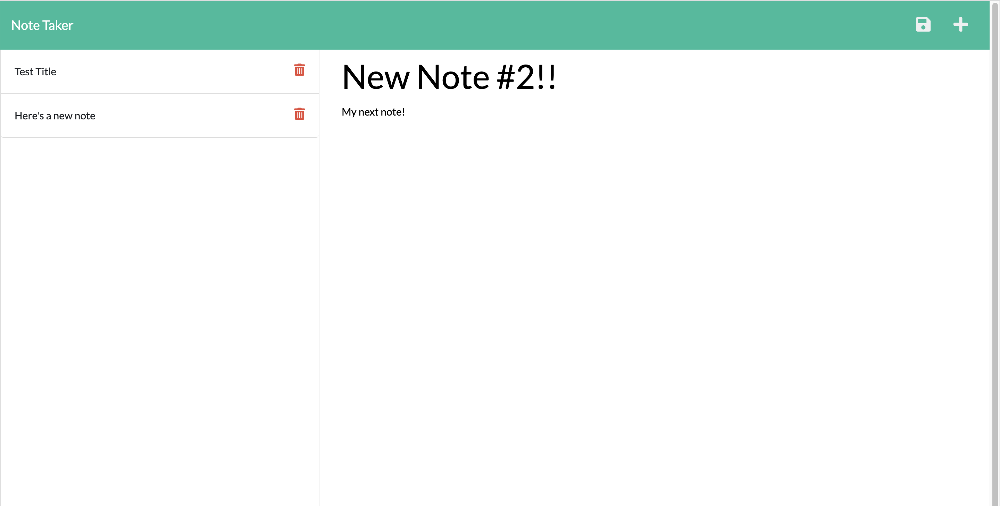

# Note Taker

## Description
This is a simple note-taking app that allows a user to create and save a note using express.js server capabilities.  Notes are saved at the db.json file.  Users can delete notes as desired.

Use the + icon to add anew note.  Press the save icon to save it.  Press the red trash can icon beside a note to delete.

Created with HTML, CSS, and JavaScript including node.js and express.js.

Deployed with Heroku. 

## Installation
To run the code in an editor, first install the dependencies for express.js by typing in the command line "npm install".  Run the server by using "npm start".

## Application
https://note-taker-app-ch.herokuapp.com/

## Screenshots

 

 

## Contributions

Back-end code by Chris Hodges.
Front-end code provided by UNC Bootcamp.

